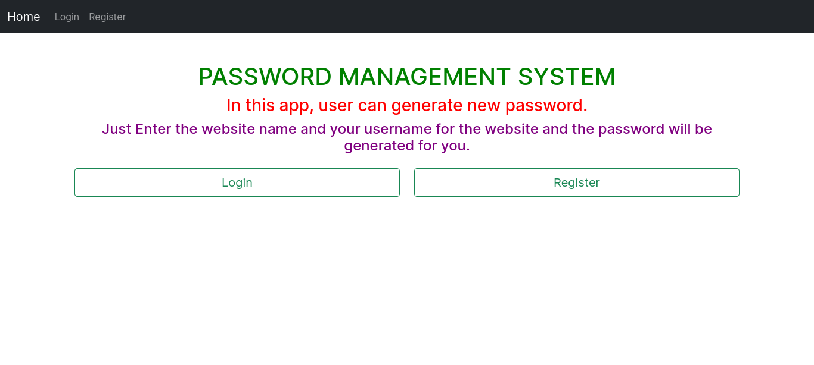
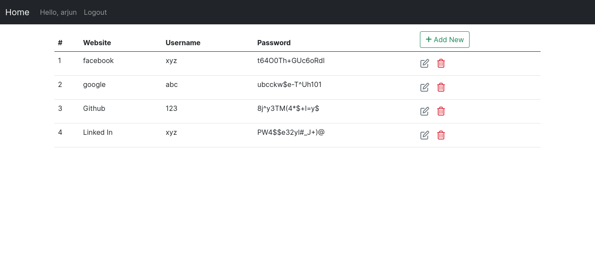
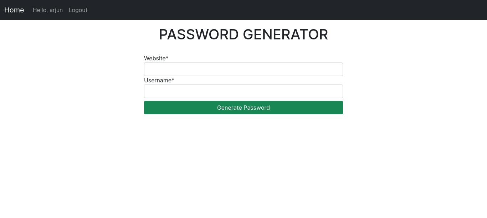

# PASSWORD MANAGEMENT SYSTEM IN DJANGO 

# Project Live @https://password-2eyt.onrender.com
### Note: The live site is hosted on free tier @render.com, so it may take some time to load the data.


## Installation

Start by either Downloading Zip file or Clone the repo

```bash
  git clone https://github.com/giriarjun111/Password-Management-System.git
  cd Password-Management-System
```

```bash
  Create a virtual environment and activate
      pip install virtualenv
      virtualenv envname
  For Mac OS / Linux:
      source envname/bin/activate
  For Windows:
      envname\scripts\activate
```
```bash
  Rename .env.example to .env and Add the values for the follwing or copy this:
    SECRET_KEY=a0kqo78v_8bv=5jkqbtgt$w3(h7xe&(bspu*6s+429=rh+2xd!
    DEBUG=True
    EMAIL_BACKEND = 'django.core.mail.backends.smtp.EmailBackend'
    EMAIL_HOST = 'smtp.gmail.com'
    EMAIL_PORT = 587
    EMAIL_HOST_USER = 'youremail@gmail.com'
    EMAIL_HOST_PASSWORD = 'yourpassowrd'
    EMAIL_USE_TLS = True
    DEFAULT_FROM_EMAIL = EMAIL_HOST_USER
```

```bash
  pip install -r requirements.txt
  python manage.py makemigrations
  python manage.py migrate
  python manage.py createsuperuser
  python manage.py runserver
```
    
## 🔗 Links
[](https://arjungiri.tk/)
[](https://www.linkedin.com/in/arjun-giri-full-stack-web-developer-08577519b/)
[](https://www.facebook.com/arjun.giri.5099940)


## Features

- Authentication by [Django-Allauth](https://django-allauth.readthedocs.io/en/latest/)
- Social Authentication (Google)
- User can Generate and save Password
- Bootstrap Theme
- Create Password, Read Password, Update Password & Delete Password

## Tech Stack

**Client:** HTML & CSS

**Server:** Django


## Screenshots
Home Page


Password Page


Password Form Page



